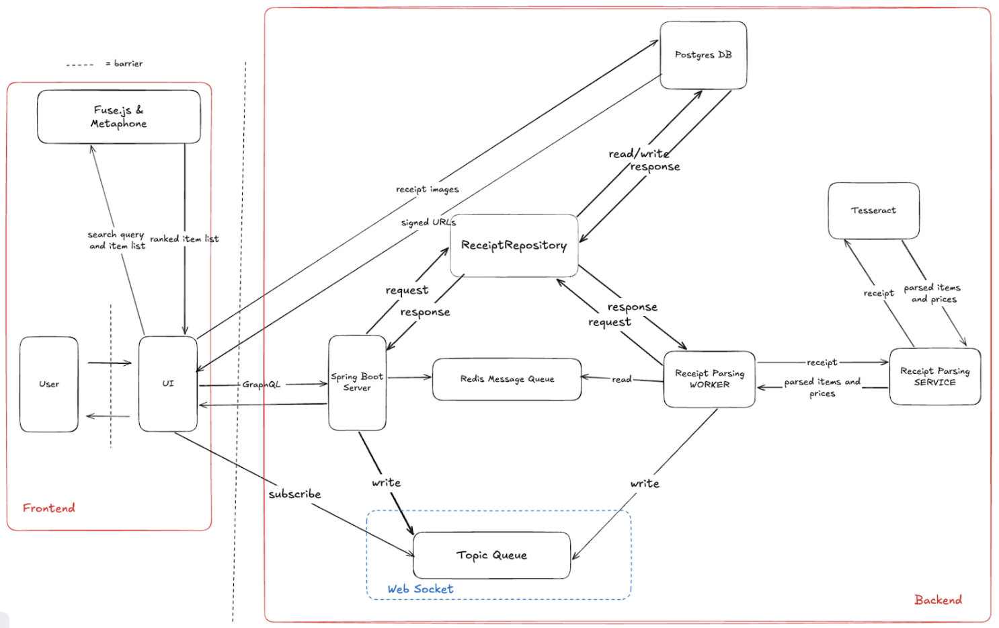

# A Better Bill Split App

## Tech Stack

**Frontend:** default Next.js project settings

- React
- TypeScript
- Tailwind
- ESLint
- App Router
- Turbopack

**Backend:**

- Server: Springboot
- Database: Postgres with Supabase
- Message Queue: Redis

## System Diagram


## System Requirements

**Frontend:**

- Node.js v20.15.0
- Next.js v16.1.6
- React v19.2.3

**Backend:**

- Java v25.0.2
- Maven v14.6.1
- Springboot v4.1.0-M1
  - GraphQL DGS Code Generation
  - Spring Boot DevTools
  - Spring for GraphQL
  - PostgreSQL Driver
  - Spring Data JPA
  - Spring Web
  - Spring Reactive Web
- Postgres
- Redis

Read more about frontend dependencies [here](./frontend/package-lock.json) and backend dependencies [here](./backend/pom.xml).

## Setting up Local Development for the First Time

### Frontend

When running the frontend for the first time, you'll first want to navigate to the `frontend` directory by doing `cd frontend` and then executing `npm i` in your terminal to install all dependencies.

Otherwise, all you need to do to view the frontend locally is to run `npm run dev` within the `frontend` directory. The frontend will then be visible at http://localhost:3000/. To stop running the frontend, you can simply use the `CTRL + C` shortcut in the terminal running it.

### Backend

In order to run the backend for the first time, there are a couple of steps that you'll need to take to make sure you meet all of the necessary system requirements. Navigate to the backend directory by doing `cd backend`, and make sure you've installed all of the following:
- **Java 25**
  - If needed, you can download it [here](https://www.oracle.com/java/technologies/downloads/#jdk25-mac).
  - Check your Java version with `java -version`.
- **Supabase**
  - In order to run and developer the backend locally, you will first need access to the project's corresponding Supabase Postgres database.
  - Then, configure your local environment variables on your terminal using `export VARIABLE_NAME='variable_value'` for DB_USERNAME, DB_PASSWORD, and DB_URL, which are referenced in the [application.properties file](./backend/src/main/resources/application.properties). For example, you would want to run `export DB_USERNAME='nameHere'`, where `'nameHere'` is replaced by your true username.
  - Run `echo $DB_USERNAME` to make sure you've configured everything correctly. Repeat this with `echo $DB_PASSWORD` and `echo $DB_URL`. Running these commands should return the value of each environment variable that you just set. You will need to re-configure these local environment variables every time you return to the backend repo. 
- **Maven**
  - This is our dependency manager for the backend, similar to how one would use `npm` for the frontend.
  - You can install maven in multiple different ways, many of which are detailed [here](https://maven.apache.org/install.html).
    - If you're using a Mac device and know you already have `brew` installed, you can simply run `brew install maven`.
  - Check your Maven version with `mvn -v`.
- **Docker Desktop**
  - If needed, you can find the installer for it [here](https://docs.docker.com/desktop/).
  - You will need the Docker app up and running on your device in order to successfully run and connect to Supabase. Simply having it open is enough for Supabase to know what to do in the steps below. 
- **First Database Run**
  - Once you have all of the above ready, you then need to follow all of the steps [in this tutorial](https://medium.com/@ianktoo/my-first-time-setting-up-supabase-locally-and-why-it-almost-broke-me-the-quick-version-a17bab7ca1b0) to properly run your database for the first time.

Then, in the `backend` directory, you'll want to:
- Run `docker redis start` to start up the Redis Message Queue.
- Run `npx supabase start` to start up the Supabase connection.
- Run `mvn spring-boot:run` to run the server.

On all subsequent runs of your database, you just want to make sure that you have the most recent version of the supabase directory on your branch before you you run the database using `npx supabase start` in the `backend` directory. Make sure you also re-configure your local environment variables as needed whenever returning to the backend repo.

To run the server, you need to executive `mvn spring-boot:run` in the `backend` directory.

Once both the server and database are running, you can go to http://localhost:8000/graphiql?path=/graphql in your browser, where you'll see a GraphQL playground where you can type in queries, such as the following:
```
query {
  getSessionById(id: 1) {
    id
    partySize
  }
}
```

To stop running the database, you will need to execute `npx supabase stop` in your backend terminal.
To stop running the Redis Message Queue, you will need to execute `docker redis stop` in your backend terminal.
To stop running the server, you can simply use the `CTRL + C` shortcut in the terminal running it.

## Subsequent Local Development Runs

First, configure your local environment variables are needed by running `export DB_VARIABLE_NAME='variable_value'` for the DB_USERNAME, DB_PASSWORD, and DB_URL. 

Next, navigate to the `backend` folder and start up everything on the backend:
1) Confirm you have the most recent version of the `supabase` directory on your branch.
2) Run the following to make sure you're dependencies and target folder are up to date based on any changes: `mvn clean install`.
3) Open Docker Desktop on your machine.
4) Run the database: `npx supabase start`.
5) Start up the Redis Message Queue: `docker start redis`.
6) Run the server: `mvn spring-boot:run`.

In a different terminal, navigate to the `frontend` folder to start up the frontend:
1) Reinstall dependencies just in case they've changed: `npm install`.
2) Run the client app: `npm run dev`.

To stop local development:
- To stop running the database, you will need to execute `npx supabase stop` in the `backend` directory.
- To stop running the Redis Message queue, you will need to execute `docker stop redis` in the `backend` directory.
- You can simply use `CTRL + C` to stop the server and client app in the terminals they're running in.

## Troubleshooting Supabase Migration History Mismatches
```
The remote database's migration history does not 
match local files in supabase/migrations directory.
```
This issue occurs when there's a mismatch between the migration files stored locally in the `supabase/migrations1 directory and the migration history recorded in your remote Supabase database. This typically happens when:
- Migrations were applied directly to the remote database without being committed locally
- Local migration files were deleted or modified after being applied remotely
- You're working on a different branch or pulled changes that modified migrations
- The local and remote databases got out of sync

You can fix it by resetting your local database with the following commands:
```
# Stop the local Supabase instance
npx supabase stop

# Delete the local database volume
docker volume rm supabase_db_backend

# Restart Supabase (this will reapply all migrations)
npx supabase start
```

Best practices to avoid this problem:
- Always commit migration files to version control before applying them remotely
- Pull the latest changes from your team before creating new migrations
- Use `npx supabase db push` to sync local migrations to remote
- Don't manually edit migration files that have already been applied

## References

### Setup & Installation

Next.js Project Creation: https://nextjs.org/docs/app/getting-started/installation\
Springboot Project Creation: https://start.spring.io/\
Connecting Springboot and Postgres: https://medium.com/@AlexanderObregon/using-spring-boot-with-postgresql-for-data-persistence-49e843ab46fc\
Setting up Supabase: https://medium.com/@ianktoo/my-first-time-setting-up-supabase-locally-and-why-it-almost-broke-me-the-quick-version-a17bab7ca1b0\
Creating Supabase tables: https://supabase.com/docs/guides/local-development/overview\
Connecting to database: https://supabase.com/docs/guides/database/connecting-to-postgres\
Getting Started with Spring Boot and PostgreSQL: https://dev.to/codereacher_20b8a/getting-started-with-spring-boot-and-postgresql-a-beginner-friendly-guide-2mhb\

### GraphQL

Building a GraphQL service: https://spring.io/guides/gs/graphql-server\
Class Notes App: https://github.com/CS-396-Full-Stack-Software-Eng/notes_app/blob/w6_eda_notes_summary_grpc/backend_spring/src/main/java/com/notes/app/data/Note.java\
Using Spring Boot with PostgreSQL for Data Persistence: https://medium.com/@AlexanderObregon/using-spring-boot-with-postgresql-for-data-persistence-49e843ab46fc\
Spring Boot GraphQL Tutorial: Simplify Your API with Query by Example: https://www.youtube.com/watch?v=J8vC8RflPPY&t=2s\

### General Documentation

Springboot: https://docs.spring.io/spring-boot/index.html\

## Contributors (AKA "Team Pancakes")

Brock Brown\
Vivian Chen\
Samreen Ibrahim\
Sidney Robinson\
Joanna Soltys
